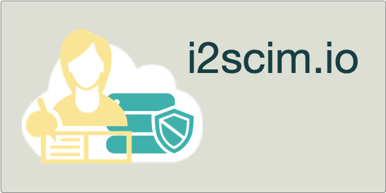

# What is **i2scim**?

**i2scim** is a Kubernetes (K8S) deployable server implementation of the IETF SCIM 
specification for provisioning of 
Identities as an directory service. **i2scim** is as a generalized SCIM engine that supports configured endpoints 
and schemas defined in json. Unlike other SCIM implementations, **i2scim** does not have fixed resource types.
**i2scim** reads a K8S `configMap` containing JSON formatted definitions of resources and attributes (aka SCIM Schema).
At its core, **i2scim** is a JSON document centric engine that converts from the SCIM Restful HTTP API to backend 
persistence services such as MongoDb.

This open source project licensed under the Apache License 2.0.

**i2scim** is extensible in key ways:
* It can configured to support custom attributes/claims, and object types for special purposes
* For deployers looking to implement SCIM as a standard User provisioning API for their application, **i2scim** may be
adapted to act as a gateway to internal proprietary identity APIs by implementing a custom provider.
* It has a built in events interface that can be used to trigger async events and notifications (more to come).

But wait, what is IETF SCIM? 
- For more information on SCIM, See "What is SCIM?" below.

## What is i2scim useful for?
**i2scim** is a K8S deployable service that supports scenarios such as:
* An extensible identity data store for customer/user accounts shared by one or more services in a K8S cluster.
* An account provisioning service for integration with enterprise provisioning connectors.
* A standardized, interoperable web gateway for an internal database or API.
* An event engine that can be used to trigger and receive asynchronous events via message queues such as Apache Kafka.
  
## How do I get started?

* Github
    * [GitHub Repository](https://github.com/i2-open/i2scim)
    * [Discussions](https://github.com/i2-open/i2scim/discussions)
    * [Issues](https://github.com/i2-open/i2scim/issues)
    * [Contributing](CONTRIBUTING.md)
    * [Notes for developers](DeveloperNotes.md)
* Quick Starts
    * Deploying i2scim using memory database(TBD).
    * [Deploying i2scim using MongoDb on K8S](i2scim-mongo-k8s.md).
* General Documentation
    * [Configuration](Configuration.md) - i2scim Configuration Properties
    * [i2scim Access Control](AccessControl.md) - Standalone access control using i2scim
    * Open Policy Agent [Integrated Access Control](OPA_AccessControl.md) - Access control using an external [OPA Agent](https://www.openpolicyagent.org).

## i2scim Feature Details

* Configurable schema support - i2scim supports resource type schema definitions (as described in RFC7643) loaded 
  through K8S ConfigMap definitions. 
* Full SCIM V2 (RFC7644) protocol support including JSON Patch. Bulk support is planned for a future 
  release.
* Support for HTTP HEAD and HTTP Conditional [RFC7232](https://datatracker.ietf.org/doc/html/rfc7232) qualifiers.
* Kubernetes deployment using docker on Intel and ARM64 (e.g. Raspberry Pi).
* SmallRye DevOps Health, Liveness and performance interceptor support ready (e.g. grafana).
* Event system enables support for enhancements such as Apache Kafka and server-to-server multi-master replication (see
  other).
* Security features
    * [Access Control](AccessControl.md) support - acis are defined in json format (as a configuration file) and are an evolved  
      version of many popular LDAP server ACI formats. i2scim acis are intended ot support the requirements defined in:
      [RFC2820](https://datatracker.ietf.org/doc/rfc2820/).
    * HTTP Authentication Mechanisms
        * [RFC7523](https://tools.ietf.org/html/rfc7523) JWT Bearer tokens - i2scim uses
          the [Quarkus SmallRye JWT](https://quarkus.io/guides/security-jwt) libraries for authentication.
        * [RFC7617](https://tools.ietf.org/html/rfc7617) HTTP Basic - i2scim supports HTTP basic authentication of users
          against Users stored in i2scim.
    * Secure password support using PBKDF2 (Password Basked Key Derivation Function 2) with salt and pepper hash for
      FIPS 140 compliance.
    * Note: at this time, i2scim does not support a web (html) interface and does not have built in support for
      session control (cookies) for browsers. Each HTTP request is individually authenticated and authorized.
* Other features:
    * i2scim may be adapted to act as a gateway (by implelementing the IScimProvider interface) databases and API 
      services.
    * Supports "virtual" attribute extensions enabling custom mapping and handling (e.g. password policy).
    * `IScimPlugin` interface enables pre and post transaction custom actions.
    * `IEventHandler` interface enables deployment of asynchronous event handlers (e.g. for replication or security
      events)
      `IVirtualValue` enables support for derived or calculated values.
    * Built on the [Quarkus](https://quarkus.io) platform version 2.16.3.Final for smaller deployments with faster 
      startup
      running in Docker containers.

Note: Inter-SCIM server replication services are not currently part of this project and are currently only supported as
part of a database cluster. For fault-tolerant scaled systems use i2scim deployed
with a [MongoDB cluster on K8S](i2scim-mongo-k8s.md) along with an enterprise MongoDB
deployment.

## Where can I get more help if needed?
Open Source i2scim is maintained by Independent Identity Incorporated on a best effort sponsored basis.
For more information, please email [info@independentid.com](mailto:pinfo@independentid.com).
-----
## What is SCIM?

SCIM (System for Cross-domain Identity Management) is an IETF specified protocol and schema designed to support 
simple cloud identity management over a REST-ful HTTP service.
See: 
 * [Introduction to SCIM](Intro-to-SCIM.md).
 * [SimpleCloud SCIM Information](https://simplecloud.info). 

In SCIM, objects are called `Resources` which have an identified schema. Like XML, a SCIM Schema describes an object,
the attributes contained, along with their syntax, mutability, etc. For example a username is usually unique across 
a domain. Unlike XML, SCIM schema is not used as a strict enforcement mechanism. After-all JSON is just JSON. 
However Schema definitions help inform parties on how to parse and use data discovered in an endpoint. These can be 
discovered using the `/Schemas` endpoint. To help SCIM protocol clients understand what resources types are 
available, SCIM servers provide and endpoint called 
`Resourcetypes` that lists the resources available on the server.

### JSON and Schema? What?
At the time of writing the SCIM protocols, REST-ful APIs were in vogue. One of the observations of the SCIM Working 
Group, is that SCIM was an HTTP based service that would be implemented by many different developers and 
organizations. This stood in stark contrast to services like the Facebook API. There were many client implementers 
but only 1 organization supporting Facebook's API. Unlike most APIs, SCIM needed mutual interoperability. WG members 
recognized that every SCIM service provider would likely be somewhat different. In order to make interop possible, 
the SCIM schema was developed. 

How SCIM and XML are alike:
* Schema defines attributes, their syntax, mutability, optionality, visibility, etc.
* The ability to register attribute names and their meanings (with IANA).

How SCIM and XML are NOT alike:
* All SCIM messages and data are just JSON
* No schema enforcement of JSON payloads. For example, undefined attributes are allowed and free to be ignored.
* SCIM follows [Postel's Law - The Robustness Principal](https://en.wikipedia.org/wiki/Robustness_principle).
What this means in practical terms, is that SCIM protocol clients are allowed to send non-conforming messages to 
  SCIM service providers. Service providers are allowed to accept what they can understand. Likewise, in their 
  response, service providers indicate what was accepted and clients must accept the response. For example, if a 
  service provider does not support a particular attribute, the service provider is free to ignore attempts to set a 
  value for the attribute. Even though there may be a broad dictionary of attributes about all people, applications 
  are free to take what they need. 

  
