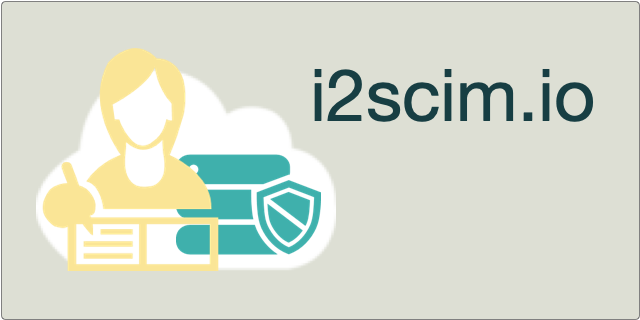

# What is **i2scim**?

**i2scim** is a Kubernetes (K8S) deployable server implementation of the IETF SCIM 
specification for provisioning of 
Identities as an directory service. **i2scim** is as a generalized SCIM engine that supports configured endpoints 
and schemas defined in json. Unlike other SCIM implementations, **i2scim** does not have fixed resource types.
**i2scim** reads a K8S `configMap` containing JSON formatted definitions of resources and attributes (aka SCIM Schema).
At its core, **i2scim** is a JSON document centric engine that converts from the SCIM Restful HTTP API to backend 
persistence services such as MongoDb.

This open source project licensed under the Apache License 2.0.

**i2scim** is extensible in key ways:
* It can configured to support custom attributes/claims, and object types for special purposes
* For deployers looking to implement SCIM as a standard User provisioning API for their application, **i2scim** may be
adapted to act as a gateway to internal proprietary identity APIs by implementing a custom provider.
* It has a built in events interface that can be used to trigger async events and notifications (more to come).

- For more information on System for Cross-domain Identify Management(SCIM), See "What is SCIM?" below.

## Recent Updates

The published image is `independentid/i2scim-universal:<version>` (also tagged `latest`),
built for `linux/amd64` and `linux/arm64`.

### Release 0.10.6

A security and hardening release. There is no `0.10.5`: that tag was already taken on Docker Hub.

* **Security:** upgraded to Quarkus 3.40.1, which fixes two jackson-databind denial-of-service
  vulnerabilities (CVE-2026-91776, CVE-2026-91777). The image's Chainguard JRE base is pinned by
  digest ([#112](https://github.com/i2-open/i2scim/issues/112)).
* **Check your clients before upgrading:**
  * Creating or updating a resource that breaks a uniqueness rule returns `409 Conflict`, not
    `400` ([#111](https://github.com/i2-open/i2scim/issues/111)).
  * `count=0` on a search returns only the total, with no resources. It used to mean "no limit"
    ([#108](https://github.com/i2-open/i2scim/issues/108)).
* **In-memory backend only:** timestamps are now always written in UTC. If the server ran on a
  JVM not set to UTC, `meta` dates stored by earlier versions will read back shifted by that
  offset ([#110](https://github.com/i2-open/i2scim/issues/110)).
* **With security enabled, bulk requests don't work yet:** each operation in a bulk request is
  refused with `403` until bulk authorization lands
  ([#117](https://github.com/i2-open/i2scim/issues/117)).
* **Fewer server errors:** bad requests (malformed JSON, filters or paging values, invalid PATCH
  paths, bad base64) now get a SCIM `400` error instead of a `500`, and a bad operation in a
  bulk request no longer fails the whole request
  ([#107](https://github.com/i2-open/i2scim/issues/107)–[#111](https://github.com/i2-open/i2scim/issues/111)).
* **PATCH fixes:** adding an array of values (for example Group `members`) no longer fails, and
  PATCH on multi-valued attributes follows RFC 7644, fixing a case where values could be lost
  ([#105](https://github.com/i2-open/i2scim/issues/105),
  [#109](https://github.com/i2-open/i2scim/issues/109)).
* **Images are published only to Docker Hub** (`independentid/i2scim-universal`). Ignore any
  `ghcr.io/i2-open/i2scim` image you may have pulled.
* Library users of `i2scim-core` and `i2scim-client`: `Meta.ScimDateFormat` was removed (use
  `Meta.formatDate` / `Meta.parseDate`), and the client now reports `400 invalidPath` as
  `InvalidPathException`.

### Release 0.10.4

A maintenance release: a platform upgrade and a schema fix. The `0.10.2` and `0.10.3` images on
Docker Hub were interim builds, so deploy `0.10.4`. It also includes everything in 0.10.2 below.

* **Schema fix: `externalId`** ([#99](https://github.com/i2-open/i2scim/issues/99))
  * The common schema now spells the attribute `externalId` (RFC 7643). It was previously
    `externalid`.
  * On the MongoDB backend, filters match `externalId` and other core attributes (`schemas`,
    `meta.*`) regardless of case.
  * Existing data and older saved schemas keep working, with no migration needed.
* **Platform upgrade** ([#100](https://github.com/i2-open/i2scim/issues/100))
  * Upgraded to Quarkus 3.39.5, with dependencies refreshed and aligned to the Quarkus BOM.
  * Fixed a MongoDB backend startup failure under the new Quarkus version.
  * The Docker Compose files use `mongo:8.2`, because `mongo:8.0` fails on recent Linux kernels.
  * Building from source requires Maven 3.9.6 or later. Use the included `./mvnw`.
* The image's version label now matches its tag.

### Release 0.10.2

* **New: RISC account events (opt-in)** — i2scim can emit
  OpenID RISC security events alongside
  its SCIM events:
  * *Account Purged* when a User is deleted.
  * *Account Enabled / Disabled* when `active` changes.
  * *Identifier Changed* when `userName` or `emails` change.
  * Enable with `scim.signals.risc.enable=true`. Tune with `scim.signals.risc.types`,
    `scim.signals.risc.identifier.attrs` and `scim.signals.risc.subject.format`
    (`scim`, `email`, `username` or `phone`). See [Configuration](Configuration.md).
* **Observability**
  * **Action required:** Prometheus metrics moved from `/metrics` to `/q/metrics`, and the
    endpoint is now anonymous. Update your scrape config or `prometheus.io/path` annotation.
    The bundled K8s manifests are already updated.
  * Optional JSON console logging (`QUARKUS_LOG_CONSOLE_JSON=true`). Set `NODE_ID` and
    `CLUSTER_NAME` to label each instance. Default output is unchanged (text).
  * The server logs its version at startup and reports it when registering with an SSF server.
* **Easier event-delivery troubleshooting**
  * Failed pushes are logged as warnings, and stream state changes are logged.
  * Per-stream success and failure counts appear on the readiness health endpoint.

### Release 0.10.1

Makes event streams (Shared Signals) more reliable and easier to operate, matching the behaviour
of [goSignals](https://github.com/i2-open/i2goSignals/blob/master/docs/operations.md).

* **Clear stream states**
  * Streams report `enabled`, `paused` (recovers on its own) or `disabled` (needs an operator).
  * Existing `ssfConfig.json` files upgrade automatically.
* **Smarter retries**
  * Retry behaviour depends on the HTTP response. For example, `403` stops, and `429` honours
    `Retry-After`.
  * i2scim checks the receiver's `/status` endpoint to tell an outage from a deliberate pause.
  * Keepalives on idle streams detect broken paths early.
* **No lost events**
  * Pending events and acknowledgements survive restarts. They are kept in MongoDB or on disk,
    depending on the backend.
  * A slow receiver no longer slows the SCIM API.
  * Retries are bounded by time (default 6 hours).
* **Operations**
  * Key file changes are picked up automatically.
  * Disk and queue usage raise warnings at configurable thresholds.
  * New settings are under `scim.signals.pub.*` and `scim.signals.rcv.*`.
* **Security and fixes**
  * Patched CVE-2026-39852 and CVE-2026-41417.
  * An unreachable JWKS endpoint no longer blocks startup.

### Release 0.10.0

* **One image for all backends** — `independentid/i2scim-universal` replaces `i2scim-mem` and
  `i2scim-mongo`. Choose the backend at runtime with `scim.prov.providerClass`.
* **Supply-chain hardening** — Images include OCI labels, an embedded SBOM and build provenance,
  and are multi-arch (amd64/arm64).
* The build is simplified to three Maven modules. Maven Central publishing is dormant (see
  [publishing.md](publishing.md) and [DECISIONS.md](../DECISIONS.md)).

### Release 0.9.1

* Security update: patched CVE-2025-27820 (Apache HttpClient).

### Release 0.9.0

* SPIFFE-compatible TLS for SSF connections.
* Trust certificates can be loaded from a file or an environment variable
  (`scim.signals.ssf.trust.certs.path` / `scim.signals.ssf.trust.certs.value`).
* Upgraded to Java 25 and Quarkus 3.34.3 (RESTEasy Reactive).
* Fixed an intermittent error when polling for events.

### Release 0.8.1

* Custom CA trust roots for SSF servers (for example, self-signed or SPIFFE cluster certificates).
* Upgraded to Quarkus 3.30.8.

### Release 0.8.0

* Supports the latest [SCIM Events draft](https://www.ietf.org/archive/id/draft-ietf-scim-events-16.html),
  with updated event URIs and asynchronous event processing.
* More robust push/poll connections to SSF servers (for example, i2goSignals).
* Upgraded to Java 21 on a hardened Eclipse Temurin image.

### Release 0.7.0

* **New: security events** — Support for the
  [SCIM Events](https://datatracker.ietf.org/doc/draft-ietf-scim-events/) draft and
  [OpenID Shared Signals Framework (SSF) draft 02](https://openid.net/specs/openid-sharedsignals-framework-1_0-02.html).
  See the [Signals documentation](Signals.md).
* A single distribution where the backend store is chosen by environment settings.
* Improved Docker Compose support. Upgraded to Quarkus 3.1.1.

### Release 0.6.1

* Documentation and CVE fixes.
* All i2scim modules are available in Maven.

### Release 0.6.0-Alpha

* **New:** externalised access policy using Open Policy Agent. See
  [i2scim Access Control With OPA](OPA_AccessControl.md).

### Release 0.5.0-Alpha

First public preview. Deployable on K8S with a MongoDB or in-memory backend.

* Core SCIM protocol (RFC 7644), except Bulk requests.
* Configurable resource types and schema (RFC 7643).
* HTTP conditional requests (RFC 7232).
* LDAP-style access control (see [AccessControl.md](AccessControl.md)).
* Basic and JWT authentication.

## What is i2scim useful for?
**i2scim** is a K8S deployable service that supports scenarios such as:
* An extensible identity data store for customer/user accounts shared by one or more services in a K8S cluster.
* An account provisioning service for integration with enterprise provisioning connectors.
* A standardized, interoperable web gateway for an internal database or API.
* An event engine that can be used to trigger and receive asynchronous events via message queues such as Apache Kafka.
  
## How do I get started?

* Github
    * [GitHub Repository](https://github.com/i2-open/i2scim)
    * [Discussions](https://github.com/i2-open/i2scim/discussions)
    * [Issues](https://github.com/i2-open/i2scim/issues)
    * [Contributing](CONTRIBUTING.md)
    * [Notes for developers](DeveloperNotes.md)
* Quick Starts
    * [Building and running locally](#building-and-running) — see below.
    * [Kubernetes deployment (memory or MongoDB backend)](../i2scim-server/k8s/README.md).
* General Documentation
    * [Configuration](Configuration.md) - i2scim Configuration Properties
    * [i2scim Access Control](AccessControl.md) - Standalone access control using i2scim
    * Open Policy Agent [Integrated Access Control](OPA_AccessControl.md) - Access control using an external [OPA Agent](https://www.openpolicyagent.org).

## Building and Running

i2scim is a three-module Maven project (`i2scim-core`, `i2scim-client`, `i2scim-server`) on Java 25 and Quarkus 3.40.x.

```bash
# Build everything (skips tests by default):
mvn install

# Build + run tests (requires MongoDB on localhost:27017 with admin/t0p-Secret):
mvn install -DskipTests=false

# Run the server in dev mode at http://localhost:8080/ :
mvn -pl i2scim-server quarkus:dev

# Build a multi-arch Docker image and push to docker.io/independentid:
./build.sh -p --tag <ver>
```

Releases are cut from a GitHub release and the Docker Hub image is pushed with `./build.sh -p`; see [Releasing the Docker image](publishing.md#releasing-the-docker-image-active-process) for the checklist (including refreshing the pinned Chainguard base-image digest).

The published Docker image is `independentid/i2scim-universal:<tag>`. The same image runs against the in-memory backend or MongoDB; the choice is made at runtime via `scim.prov.providerClass`. See [Configuration](Configuration.md) for the full property list and [k8s/README.md](../i2scim-server/k8s/README.md) for cluster deployment.

## i2scim Feature Details

* Configurable schema support - i2scim supports resource type schema definitions (as described in RFC7643) loaded 
  through K8S ConfigMap definitions. 
* Full SCIM V2 (RFC7644) protocol support including JSON Patch. Bulk support is planned for a future 
  release.
* Support for HTTP HEAD and HTTP Conditional [RFC7232](https://datatracker.ietf.org/doc/html/rfc7232) qualifiers.
* Kubernetes deployment using docker on Intel and ARM64 (e.g. Raspberry Pi).
* SmallRye DevOps Health, Liveness and performance interceptor support ready (e.g. grafana).
* Event system enables support for enhancements such as Apache Kafka and server-to-server multi-master replication (see
  other).
* Security features
    * [Access Control](AccessControl.md) support - acis are defined in json format (as a configuration file) and are an evolved  
      version of many popular LDAP server ACI formats. i2scim acis are intended ot support the requirements defined in:
      [RFC2820](https://datatracker.ietf.org/doc/rfc2820/).
    * HTTP Authentication Mechanisms
        * [RFC7523](https://tools.ietf.org/html/rfc7523) JWT Bearer tokens - i2scim uses
          the [Quarkus SmallRye JWT](https://quarkus.io/guides/security-jwt) libraries for authentication.
        * [RFC7617](https://tools.ietf.org/html/rfc7617) HTTP Basic - i2scim supports HTTP basic authentication of users
          against Users stored in i2scim.
    * Secure password support using PBKDF2 (Password Basked Key Derivation Function 2) with salt and pepper hash for
      FIPS 140 compliance.
    * Note: at this time, i2scim does not support a web (html) interface and does not have built in support for
      session control (cookies) for browsers. Each HTTP request is individually authenticated and authorized.
* Other features:
    * i2scim may be adapted to act as a gateway (by implelementing the IScimProvider interface) databases and API 
      services.
    * Supports "virtual" attribute extensions enabling custom mapping and handling (e.g. password policy).
    * `IScimPlugin` interface enables pre and post transaction custom actions.
    * `IEventHandler` interface enables deployment of asynchronous event handlers (e.g. for replication or security
      events)
      `IVirtualValue` enables support for derived or calculated values.
    * Built on the [Quarkus](https://quarkus.io) platform version 2.16.3.Final for smaller deployments with faster 
      startup
      running in Docker containers.

Note: Inter-SCIM server replication services are not currently part of this project and are currently only supported as
part of a database cluster. For fault-tolerant scaled systems use i2scim deployed
with a [MongoDB cluster on K8S](../i2scim-server/k8s/README.md) along with an enterprise MongoDB
deployment.

## Where can I get more help if needed?
Open Source i2scim is maintained by Independent Identity Incorporated on a best effort sponsored basis.
For more information, please email [info@independentid.com](mailto:pinfo@independentid.com).
-----
## What is SCIM?

SCIM (System for Cross-domain Identity Management) is an IETF specified protocol and schema designed to support 
simple cloud identity management over a REST-ful HTTP service.
See: 
 * [Introduction to SCIM](Intro-to-SCIM.md).
 * [SimpleCloud SCIM Information](https://simplecloud.info). 

In SCIM, objects are called `Resources` which have an identified schema. Like XML, a SCIM Schema describes an object,
the attributes contained, along with their syntax, mutability, etc. For example a username is usually unique across 
a domain. Unlike XML, SCIM schema is not used as a strict enforcement mechanism. After-all JSON is just JSON. 
However Schema definitions help inform parties on how to parse and use data discovered in an endpoint. These can be 
discovered using the `/Schemas` endpoint. To help SCIM protocol clients understand what resources types are 
available, SCIM servers provide and endpoint called 
`Resourcetypes` that lists the resources available on the server.

### JSON and Schema? What?
At the time of writing the SCIM protocols, REST-ful APIs were in vogue. One of the observations of the SCIM Working 
Group, is that SCIM was an HTTP based service that would be implemented by many different developers and 
organizations. This stood in stark contrast to services like the Facebook API. There were many client implementers 
but only 1 organization supporting Facebook's API. Unlike most APIs, SCIM needed mutual interoperability. WG members 
recognized that every SCIM service provider would likely be somewhat different. In order to make interop possible, 
the SCIM schema was developed. 

## Supply Chain Security

i2scim provides proper supply chain attestations to ensure the integrity and provenance of its builds.

*   **SBOM (Software Bill of Materials)**: A CycloneDX SBOM is generated during the build process, providing a comprehensive list of all dependencies.
*   **Build Provenance**: Artifact attestations are generated using GitHub's native support for SLSA-compliant build provenance. This allows users to verify that the artifacts were built in a trusted environment.
*   **Artifact Signing**: JARs and Docker images are attested using Sigstore, enabling cryptographic verification without the need for manual GPG key management (though GPG signing is still supported in the release profile).

How SCIM and XML are alike:
* Schema defines attributes, their syntax, mutability, optionality, visibility, etc.
* The ability to register attribute names and their meanings (with IANA).

How SCIM and XML are NOT alike:
* All SCIM messages and data are just JSON
* No schema enforcement of JSON payloads. For example, undefined attributes are allowed and free to be ignored.
* SCIM follows [Postel's Law - The Robustness Principal](https://en.wikipedia.org/wiki/Robustness_principle).
What this means in practical terms, is that SCIM protocol clients are allowed to send non-conforming messages to 
  SCIM service providers. Service providers are allowed to accept what they can understand. Likewise, in their 
  response, service providers indicate what was accepted and clients must accept the response. For example, if a 
  service provider does not support a particular attribute, the service provider is free to ignore attempts to set a 
  value for the attribute. Even though there may be a broad dictionary of attributes about all people, applications 
  are free to take what they need. 

  
